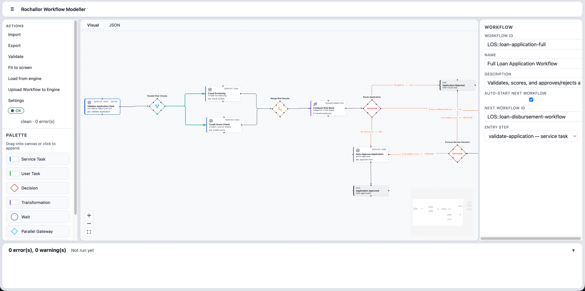

<p align="center">
  
</p>

# Rochallor Workflow Engine

A lightweight, language-agnostic workflow engine built in Go, using PostgreSQL for persistence and — by default — `FOR UPDATE SKIP LOCKED` for job distribution across competing workers. An opt-in Kafka + Transaction Outbox dispatch mode is available for deployments that have outgrown the polling path; see [Dispatch modes](#dispatch-modes) below.

## What it does

Rochallor Workflow Engine lets you define long-running business processes as a graph of steps — service tasks executed by your code, user tasks waiting for human input, decisions branching on variables, parallel branches, timers, and chained workflows. The engine stores all state in PostgreSQL and hands work out to SDK workers in any language via a poll-and-lock model.

Typical use cases:

- **Loan / credit origination** — validate → risk checks (parallel) → decision → manual review → approve/reject
- **Order fulfilment** — reserve stock → charge payment → dispatch → notify
- **Onboarding flows** — collect documents → KYC → account creation → send welcome email
- **Approval pipelines** — multi-step human approval with escalation timers

---

## How it works

```
proto/workflow/v1/engine.proto   (canonical wire contract)
              │
              ▼
┌────────────────────────────────────────────────────────┐
│                  workflow-engine (Go)                  │
│                                                        │
│  REST  :8080   /v1/definitions                         │
│                /v1/instances                           │
│                /v1/instances/{id}/user-tasks/          │
│                            {stepId}/complete           │
│                /v1/instances/{id}/signals/             │
│                            {stepId}                    │
│                /v1/jobs/poll|complete|fail             │
│                                                        │
│  gRPC  :9090   WorkflowEngine service                  │
│  Metrics :9091 /metrics (Prometheus)                   │
│                                                        │
│  [Two fully supported parallel dispatch architectures] │
│  ┌───────────────────────┐   ┌───────────────────────┐ │
│  │ Short-Polling Mode    │   │ Event-Driven Mode     │ │
│  │ (Default)             │   │ (Opt-In)              │ │
│  │                       │   │                       │ │
│  │ PostgreSQL            │   │ PostgreSQL            │ │
│  │ FOR UPDATE            │   │ Transaction Outbox    │ │
│  │ SKIP LOCKED           │   │        │              │ │
│  │ job queue             │   │        ▼              │ │
│  │                       │   │ Kafka Broker(s)       │ │
│  └───────────┬───────────┘   └────────┬──────────────┘ │
└──────────────┼────────────────────────┼────────────────┘
               │ (Polling)              │ (Consuming)
      ┌────────┴─────────┬──────────────┴─────────┐
      ▼                  ▼                        ▼
   Go SDK             Java SDK               Node/TS SDK
```

1. **Define** — upload a workflow definition (JSON) once via `POST /v1/definitions`.
2. **Start** — create an instance via `POST /v1/instances`; seed it with input variables.
3. **Work** — SDK workers poll for `SERVICE_TASK` jobs, execute your handler, and call `complete_job` or `fail_job`.
4. **Branch** — `DECISION` steps evaluate expressions against live variables and route to the next step automatically.
5. **Wait** — `USER_TASK` and `WAIT` steps park the instance until an external signal arrives.
6. **Complete** — the instance reaches an `END` step and is marked `COMPLETED`; optionally it chains into the next workflow.

---

## Supported step types

| Type | What it does |
|------|-------------|
| `SERVICE_TASK` | Creates a job that SDK workers poll and execute. Supports retries. |
| `USER_TASK` | Pauses the workflow until `POST /v1/instances/{instanceId}/user-tasks/{userTaskId}/complete` is called, where `userTaskId` is the stable step id from the workflow definition. |
| `DECISION` | Evaluates boolean expressions against workflow variables; routes to the first match. |
| `TRANSFORMATION` | Sets or rewrites variables inline — no worker needed, completes instantly. |
| `WAIT` | Parks the instance until a boundary timer fires or a signal arrives via `POST /v1/instances/{instanceId}/signals/{waitStepId}`. The signal body (optional) is shallow-merged into the instance variables on resume. |
| `PARALLEL_GATEWAY` | Fans out to multiple branches that execute concurrently. |
| `JOIN_GATEWAY` | Waits for all parallel branches to converge before advancing. |
| `END` | Marks the instance `COMPLETED`. A workflow may have multiple named `END` steps. |

Boundary **TIMER** events can be attached to `SERVICE_TASK`, `USER_TASK`, and `WAIT` steps to fire escalations or timeouts while the step is still active.

---

## Minimal workflow example

```json
{
  "id": "order-fulfil",
  "name": "Order Fulfilment",
  "steps": [
    {
      "id": "reserve-stock",
      "name": "Reserve Stock",
      "type": "SERVICE_TASK",
      "jobType": "reserve-stock",
      "retryCount": 3,
      "nextStep": "charge-payment"
    },
    {
      "id": "charge-payment",
      "name": "Charge Payment",
      "type": "SERVICE_TASK",
      "jobType": "charge-payment",
      "retryCount": 2,
      "nextStep": "check-payment-result"
    },
    {
      "id": "check-payment-result",
      "name": "Check Payment Result",
      "type": "DECISION",
      "conditionalNextSteps": {
        "#paymentStatus == 'SUCCESS'": "dispatch-order",
        "#paymentStatus == 'FAILED'":  "end-payment-failed"
      }
    },
    {
      "id": "dispatch-order",
      "name": "Dispatch Order",
      "type": "SERVICE_TASK",
      "jobType": "dispatch-order",
      "nextStep": "end-complete"
    },
    { "id": "end-complete",       "name": "Order Complete",       "type": "END" },
    { "id": "end-payment-failed", "name": "Payment Failed",       "type": "END" }
  ]
}
```

The matching worker (any SDK, any language):

```python
@registry.register("charge-payment")
def charge_payment(ctx: dict) -> dict:
    result = payment_gateway.charge(ctx["variables"]["orderId"])
    return {"paymentStatus": result.status}   # merged into instance variables
```

---

## Key design properties

- **No framework dependencies in SDKs** — each SDK is a thin polling library. No Spring, no DI container, no special runtime.
- **Stateless workers** — workers hold no in-memory state between jobs. Restart, redeploy, or scale them at will.
- **At-least-once delivery** — if a worker crashes mid-job, the 30 s lease expires and the engine re-queues the job for another worker.
- **Idempotent completion** — calling `complete_job` after a lease has expired is safe and does not double-count.
- **Variables are the interface** — steps communicate entirely through the shared variable map. No message schemas, no custom serialisation.
- **Versioned definitions** — each upload creates a new version. Running instances stay pinned to their original version; new instances pick up the latest.

---

## Dispatch modes

The engine supports two dispatch models, chosen per deployment via a single environment variable. The default is **short-polling** and is what you get if you do nothing. Event-driven is an **opt-in** alternative for high-scale deployments.

| | Short-polling (default) | Kafka + Transaction Outbox (opt-in) |
|---|---|---|
| How you get it | Ships today. No new config required. | Set `WE_DISPATCH_MODE=kafka_outbox` plus Kafka connection env vars. |
| Infra needed | PostgreSQL only | PostgreSQL **and** Kafka cluster |
| Delivery semantics | Strong — row lock is the single truth | At-least-once; workers must be idempotent |
| Dispatch latency (typical) | ~half the poll interval (≈200–500 ms) | Milliseconds (push-based) |
| Horizontal scaling | Bounded by PG row-lock contention | Approximately linear until broker/worker capacity |
| Ops cost at low traffic | Near zero | Non-trivial (Kafka cluster to run and monitor) |
| Ordering guarantee | Effectively global FIFO per `jobType` | FIFO per workflow instance (partition key = `instance_id`); **not** global |

### Straightforward recommendation

**The engine fully supports both architectures in parallel. You choose which one fits your use case.**

**Use Short-polling (Default) when:**
- Your throughput is under `~3,000` jobs/sec.
- You prioritize operational simplicity and minimal infrastructure footprint.
- Your worker handlers are I/O bound or take significant time to process.

**Use Kafka + Outbox (Event-Driven) when BOTH of these are true:**
1. **Scale bottleneck:** Your workload has hit the polling path's PostgreSQL row-lock contention ceiling (e.g., sustained `wait_event_type='Lock'`, plateauing throughput, rising lock-conflict metrics). Typically this happens at `> 3,000 - 5,000` jobs/sec.
2. **Operational readiness:** Your team already runs Kafka in production or has a credible budget to invest in it. Kafka is not a "set and forget" dependency.

> If **either** condition fails, stay on polling. Adding Kafka because it is "more modern" rather than because it solves a measured problem is a net regression for most deployments. The opt-in path exists to unblock a specific scale tier — not to recommend itself over the default.

**You do not need to pick now.** Polling is the default, works forever with no broker, and you can opt in later without an all-or-nothing migration (mode switch + restart, no manual SQL).

---

## Workflow Modeller

The repository includes a browser-based visual editor that reads and writes the same JSON contract the engine consumes.
<p align="left">
  
</p>

**Key capabilities**

- Drag-and-drop canvas — add, edit and connect steps visually.
- Live validation — all engine rules are enforced inline; errors and warnings appear directly on the affected nodes.
- Engine integration — connect to a running engine to load existing definitions or publish new ones without leaving the browser.
- Offline authoring — the editor is fully functional without an engine; import/export JSON at any time.
- Auto-layout — one-click Tidy button routes the graph with ELK, eliminating manual positioning.

**Quick start**

```bash
cd workflow-modeller
pnpm install
pnpm dev          # opens at http://localhost:5173
```

For full setup instructions, available scripts, and the spec docs, see **[workflow-modeller/README.md](workflow-modeller/README.md)**.

> **`workflow-engine/validate-fixture` — compiled binary, not source**
>
> The `workflow-engine/` directory contains a pre-built binary named `validate-fixture`. It is the compiled form of `workflow-engine/cmd/validate-fixture/main.go` — a small Go CLI that runs the engine's authoritative parser and validator against a single workflow JSON file and prints `{"accepted": bool, "error": "..."}` on stdout. It is called by the workflow-modeller's drift-guard harness to verify that every fixture accepted by the TypeScript validator is also accepted by the Go engine (the mechanical guarantee that the two implementations stay in sync). You do not need to run it directly; the modeller's test suite invokes it automatically.

---

## Documentation

| Topic | Description |
|-------|-------------|
| [Architecture](docs/architecture.md) | System overview, transport support, parallel job processing, throughput estimates |
| [Getting Started](docs/getting-started.md) | Prerequisites and step-by-step quick start |
| [Workflow JSON Format](docs/workflow-format.md) | All step types, expression syntax, variables, validation rules, annotated example |
| [Configuration](docs/configuration.md) | Engine environment variables |
| [Development](docs/development.md) | Running tests, building proto code, validating REST contracts |

## SDK References

| SDK | Transport           | Location |
|-----|---------------------|----------|
| [Go SDK](docs/sdk/go.md) | REST + gRPC + Event | `workflow-sdk-go/` |
| [Java SDK](docs/sdk/java.md) | REST + gRPC + Event | `workflow-sdk-java/` |
| [Node / TypeScript SDK](docs/sdk/node.md) | REST + gRPC + Event | `workflow-sdk-node/` |
| [Python SDK](docs/sdk/python.md) | REST + Event        | `workflow-sdk-python/` |
